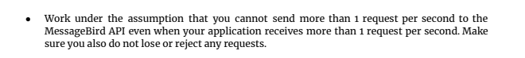
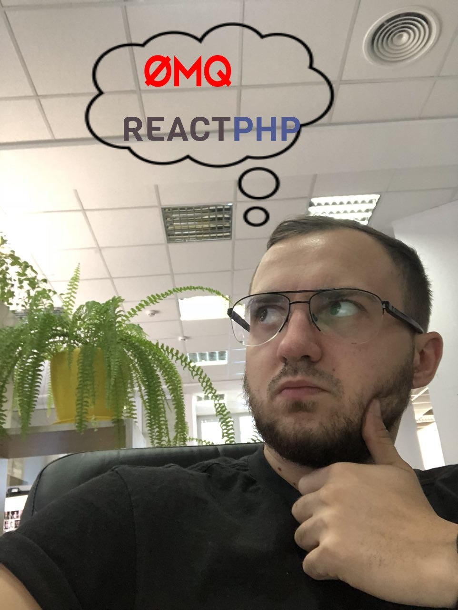

Good day, here is a little explanation for testing assignment.

So, when I first read an assignment, I saw a requirement:



So my thoughts were like:




But after that I saw:


Damn, what a disappointment! :)

So, to implement the logic with 1 request per second, we would need some kind of pool with messages.
Let's suggest two scenarios, when we have a lot of RAM or when we have a lot of disk space.
In the first case, I have implemented a socket server, which accepts messages, enqueues them and checks messages with last sent time.
For the second case, I have implemented a file worker, which read message requests from a file and also send them one per second.

Let's move to the main part.
As I saw from the [article](https://en.wikipedia.org/wiki/GSM_03.38), the SMS can have two encodings, GSM 03.38 and UTF-8, depending, which symbols it contains.
Firstly, I thought that I would need also to translate symbols to GSM_03.38, but then I realized that your service do it automatically, but my implementation has a part of this functionality. I have taken the table of UNICODE->GSM03.38 from [here](https://www.unicode.org/Public/MAPPINGS/ETSI/GSM0338.TXT)
UDH was not a problem also, because there is a good explanation about it on [wiki](https://en.wikipedia.org/wiki/Concatenated_SMS)

The assignment can be run with a docker-compose:

```
docker-compose up
```

Or you can run it manually, by running web part with command:

```
php -S 0.0.0.0:8001 src/Web/index.php
```

And worker part with command:
```
php src/start.php
```

All configs are located in the [config.php](config.php) file.

Thats all, have a good day!
